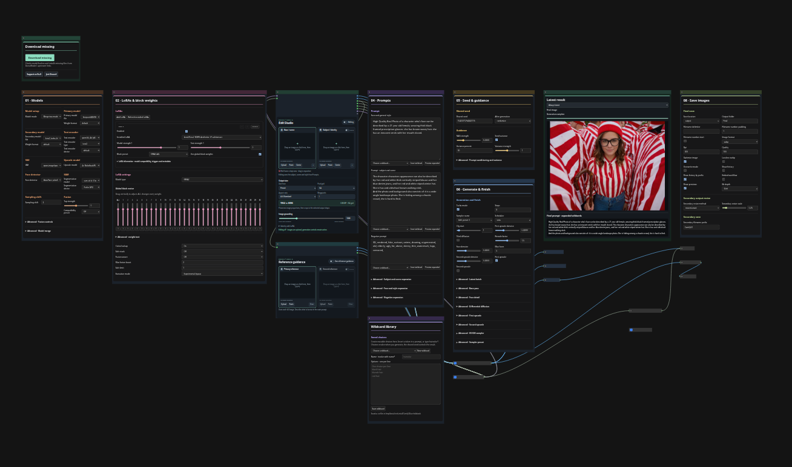

# DonutNodes + Donut Workflow V4 Beta

[](https://ko-fi.com/donutsdelivery)

**Donut Workflow is the main workflow for this node pack.** DonutNodes is built
around its Krea2 model setup, LoRA controls, editing, prompting, generation and
saving. You can also use the individual nodes in your own ComfyUI workflows.

## Start with Donut Workflow V4 Beta

**[Download the workflow](workflows/v4-beta/DonutWF_v4_beta.json)** ·
**[Setup and usage](workflows/v4-beta/README.md)** ·
**[V3 → V4 Beta changelog](workflows/v4-beta/CHANGELOG.md)**



**New look, you will be shook.** V4 Beta replaces V3's spread-out controls with
numbered cards, collapsible Advanced settings and inspectable source/generation
subgraphs. Everyday controls stay accessible in Graph and App Mode.

- **Edit Studio:** base and optional identity images, paste/drop/upload, visual
  crop controls and output sizing in one place.
- **Reference guidance:** optional image references for native Krea2 generation
  conditioning, separate from the edit-LoRA path.
- **Wildcard library:** create reusable prompt choices, insert tokens and inspect
  the final expanded prompt.
- **Model downloads:** check selected models against a reviewed catalog and
  download missing files with size/hash verification.
- **Latest result:** follow generation stages and view intermediate/final images.
- **Donut Image Save:** numbered filenames and configurable formats, including
  WebP, without a WAS dependency.

V3 already included face detailing, editing, model merging, LoRA stacking and
upscaling. The [changelog](workflows/v4-beta/CHANGELOG.md) separates those existing
capabilities from V4 Beta's additions and installation fixes.

## Installation

1. Install or update **DonutNodes to the code accompanying V4 Beta**. In ComfyUI
   Manager, search for **DonutNodes**. If the installed release does not yet
   contain `DonutImageSave` and `DonutEditStudio`, use the matching beta source;
   an older package is not sufficient.
2. Restart ComfyUI and refresh the browser, then download the workflow JSON using
   GitHub's **Download raw file** button and open it in ComfyUI.
3. Use **Install Missing Nodes → Install All**, then **Apply Changes/restart**.
   Leave the collapsed **Required node packs** subgraph in place for dependency
   detection. No WAS version selection is needed.
4. Select your models/LoRAs, use **Download missing** for catalogued files, review
   the prompts and save settings, and click **Run**.

See the [workflow README](workflows/v4-beta/README.md) for model filenames,
companion packs, editing, wildcard files, saving and migration from V3.

### Manual node installation

```bash
cd ComfyUI/custom_nodes
git clone https://github.com/DonutsDelivery/ComfyUI-DonutNodes.git donutnodes
cd donutnodes
python -m pip install -r requirements.txt
```

Use the Python interpreter that launches ComfyUI, then restart and refresh.
For an existing checkout, update it rather than creating a duplicate node folder.
The workflow release name **V4 Beta** is separate from the DonutNodes package
version. These documents and the bundled JSON are prepared with the current
source; this is not a claim that an older registry release contains the beta.

## Beta test status

The current development code passed a fresh Linux/Python 3.12.7 installation
with **default missing-node installs → restart → full generation** on an RTX
4070. No WAS installation, manual version selection or dependency repair
was required. The tested path includes base generation, first upscale, two face
refinements and a 1728 × 1344 WebP save.

That run reused models and had editing and the second upscale off. Other modes,
platforms and GPU configurations still need beta coverage. See the
[validation report](docs/validation/no-was-fresh-install-2026-09-09.md) for exact
scope and remaining warnings. For errors, include the workflow, versions,
OS/GPU and full traceback; **Donut Dependency Check** helps diagnose dependencies.

## Using the nodes independently

The pack also includes block-weighted LoRA stacking, Krea2 model merging and
Fusion Control, CFG sampling curves, detailers, tiled upscaling, SDXL TeaCache
and spectral sharpening. Experimental execution modes remain optional.

- [Node guide and advanced settings](docs/node-guide.md)
- [Dependency diagnostics and compatibility](docs/dependencies.md)
- [Third-party licenses and attribution](THIRD_PARTY_NOTICES.md)

### Optional companion packages

- [ComfyUI-DonutLocalAutomation](https://github.com/DonutsDelivery/ComfyUI-DonutLocalAutomation): local Prompt Receiver and Image Reporter nodes.
- [ComfyUI-DonutCivitaiLocal](https://github.com/DonutsDelivery/ComfyUI-DonutCivitaiLocal): local CivitAI library and workflow-recovery tools.

These are separate from the seven companion packs required by V4 Beta. Install
DonutLocalAutomation to retain `DonutPromptReceiver` and `DonutImageReporter`
when using older personal workflows that contain them.

## Third-party attribution

See [THIRD_PARTY_NOTICES.md](THIRD_PARTY_NOTICES.md) for incorporated code and its licenses.
